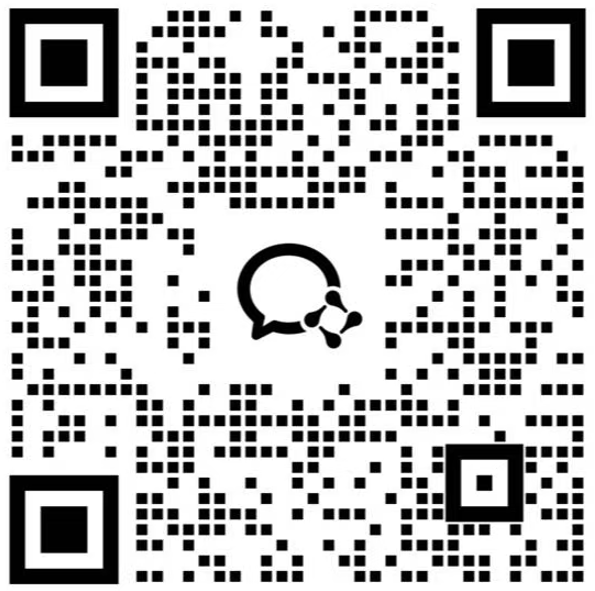

<p align="center">
  
</p>

<h1 align="center">ClawFast</h1>

<p align="center">
  <strong>The Desktop Admin Console for OpenClaw</strong>
</p>

<p align="center">
  A cleaner, more operational way to manage OpenClaw on desktop.
</p>

<p align="center">
  <a href="#overview">Overview</a> ·
  <a href="#screenshots">Screenshots</a> ·
  <a href="#features">Features</a> ·
  <a href="#getting-started">Getting Started</a> ·
  <a href="#packaging">Packaging</a> ·
  <a href="#project-structure">Project Structure</a> ·
  <a href="#roadmap">Roadmap</a> ·
  <a href="#contact">Contact</a>
</p>

<p align="center">
  
  
  
  
  
</p>

<p align="center">
  English | <a href="README.zh-CN.md">简体中文</a>
</p>

---

## Overview

**ClawFast** is a productized desktop admin console built around OpenClaw. It is designed for teams and operators who want a steadier, more visual workflow for model routing, channel access, scheduled jobs, session inspection, usage review, and daily maintenance.

Instead of pushing everything through config files and terminal-first flows, ClawFast brings the most common OpenClaw management tasks into a focused desktop interface that is easier to operate, easier to verify, and easier to hand over across teams.

Current integration target:

- `openclaw@2026.3.2`

### Why ClawFast

| Need | ClawFast Approach |
|---|---|
| Routine operations | A unified desktop console for configuration, channels, cron jobs, sessions, and usage |
| Safer changes | Readable forms, previews, and validation before writing config |
| Faster onboarding | Productized UI instead of requiring every user to understand internal config structure |
| Daily visibility | Dashboard, usage inspection, session history, and config preview in one place |

---

## Screenshots

<p align="center">
  
</p>

<p align="center">
  
</p>

<p align="center">
  
</p>

<p align="center">
  
</p>

<p align="center">
  
</p>

<p align="center">
  
</p>

<p align="center">
  
</p>

<p align="center">
  
</p>

---

## Features

### Provider-Based Model Configuration

Configure model providers, maintain model lists, and manage route selection through a visual flow instead of editing raw config by hand.

### Scheduled Task Management

Create and edit scheduled jobs in modal flows, with support for both regular creation and advanced creation paths.

### Channel Operations

Manage multi-platform channel configuration in one place, with a consistent add-flow and clearer status display.

### Session And Usage Visibility

Inspect sessions, message history, usage totals, charts, and config snapshots from the same desktop console.

### Desktop-First Experience

ClawFast supports light and dark themes, Chinese and English UI, and packaging modes for different deployment styles.

---

## Getting Started

### Install dependencies

```bash
npm install
```

### Start development

```bash
npm run dev
```

### Run type check

```bash
npm run typecheck
```

### Build renderer

```bash
npm run build:renderer
```

---

## Packaging

### With OpenClaw

Bundles OpenClaw into the desktop app. ClawFast can start the bundled gateway on demand.

```bash
npm run package:win
```

### Admin Only

Packages ClawFast as a pure management console. It does not automatically start a gateway.

```bash
npm run package:win:admin
```

You can also package for other platforms:

```bash
npm run package:mac
npm run package:mac:admin

npm run package:linux
npm run package:linux:admin
```

---

## Project Structure

```text
main/       Electron main process, gateway integration, IPC
renderer/   Desktop UI built with Next.js + React
shared/     Shared types and contracts between main and renderer
scripts/    Build, packaging, OpenClaw bundling, Node runtime bundling
resources/  Icons, screenshots, and packaging resources
```

---

## Tech Stack

- Electron
- Nextron
- Next.js
- React
- TypeScript
- Tailwind CSS
- OpenClaw

---

## Release Checklist

Before publishing a release, verify at least the following:

- packaged app connects to the expected gateway target
- bundled OpenClaw mode starts the bundled gateway correctly
- `admin-only` mode does not auto-start OpenClaw
- model provider configuration saves and loads correctly
- scheduled tasks can be created, edited, disabled, and deleted correctly
- packaged icons and Windows taskbar identity are correct

---

## Roadmap

- Continue refining provider configuration and route management
- Improve scheduled task editing, validation, and advanced fields
- Keep unifying desktop visual language across all major pages
- Polish packaging, release readiness, and onboarding documentation
- Expand operational visibility for channels, sessions, and usage

---

## Contributing

Contributions are welcome. If you want to improve ClawFast, a good starting point is:

1. Fork the repository.
2. Create a feature branch.
3. Keep changes focused and easy to review.
4. Run type checks before submitting.
5. Open a pull request with a clear summary.

---

## Contact

<table align="center">
  <tr>
    <td align="center">
      
      <br />
      <strong>Feishu</strong>
      <br />
      Product updates and direct communication.
    </td>
    <td align="center">
      
      <br />
      <strong>Enterprise WeChat</strong>
      <br />
      Business contact and collaboration.
    </td>
    <td align="center">
      
      <br />
      <strong>Discord</strong>
      <br />
      Community discussion and support.
    </td>
    <td align="center">
      
      <br />
      <strong>WhatsApp</strong>
      <br />
      Fast mobile contact.
    </td>
  </tr>
</table>

---

## License

This project is licensed under the [MIT License](./LICENSE).
