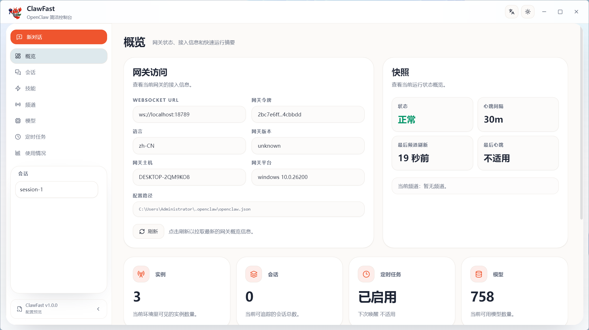
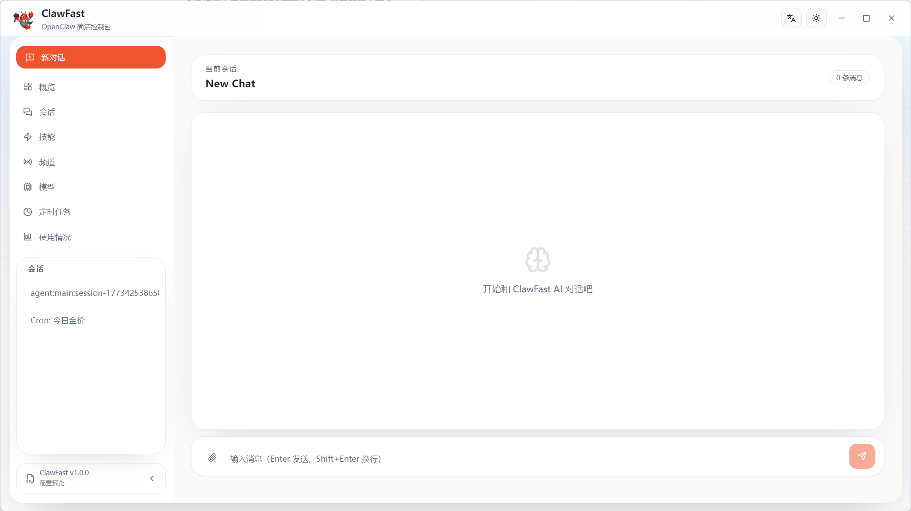
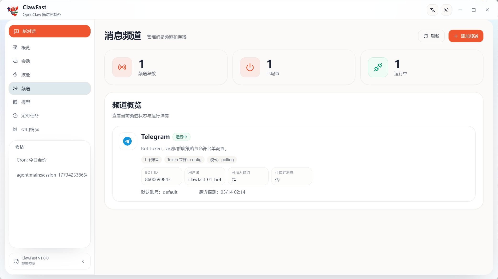
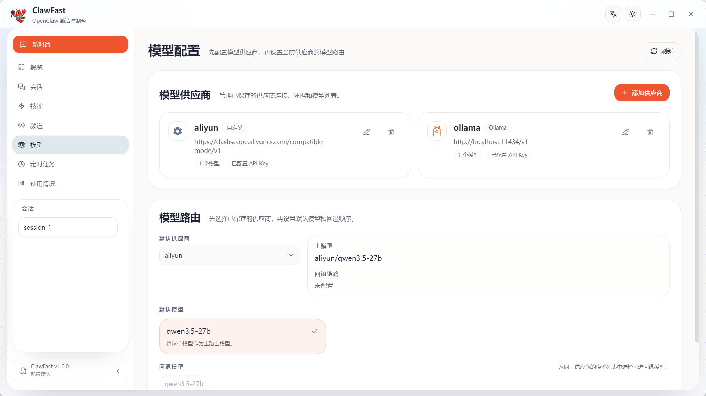
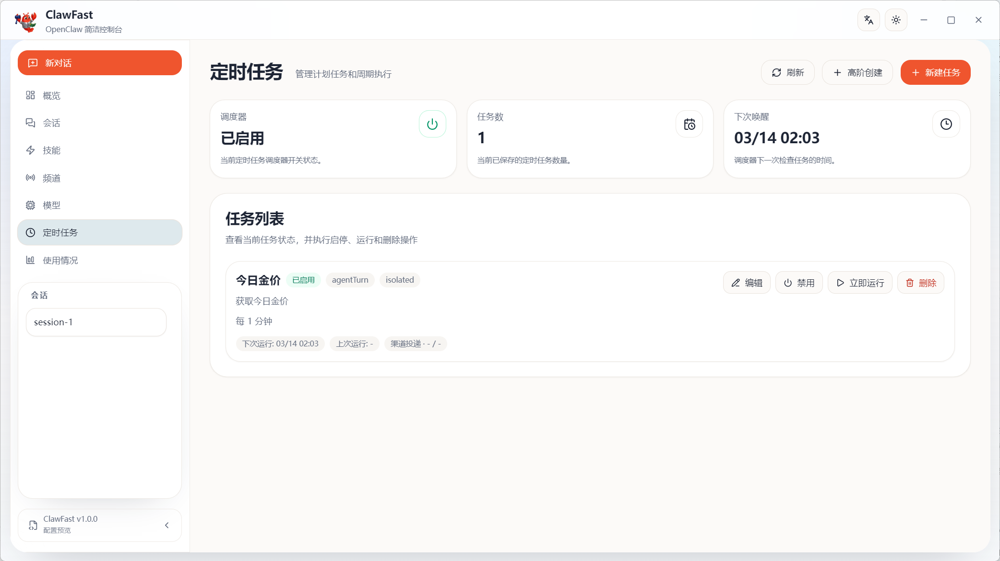
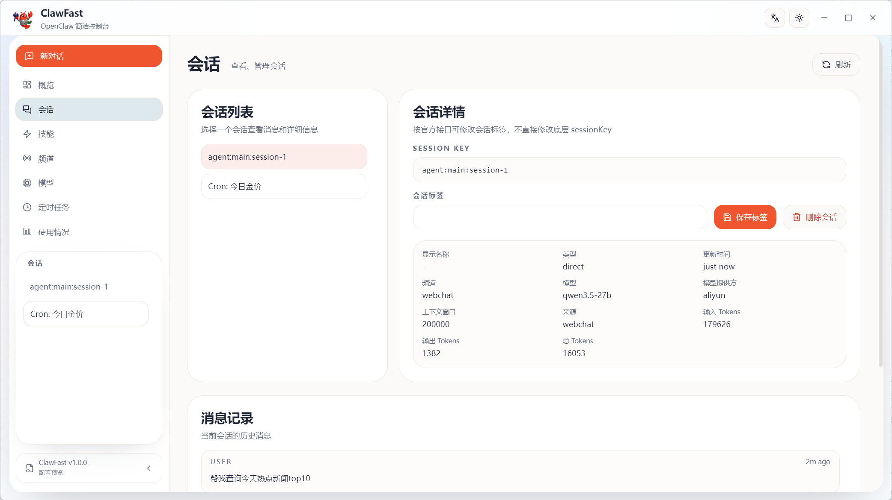
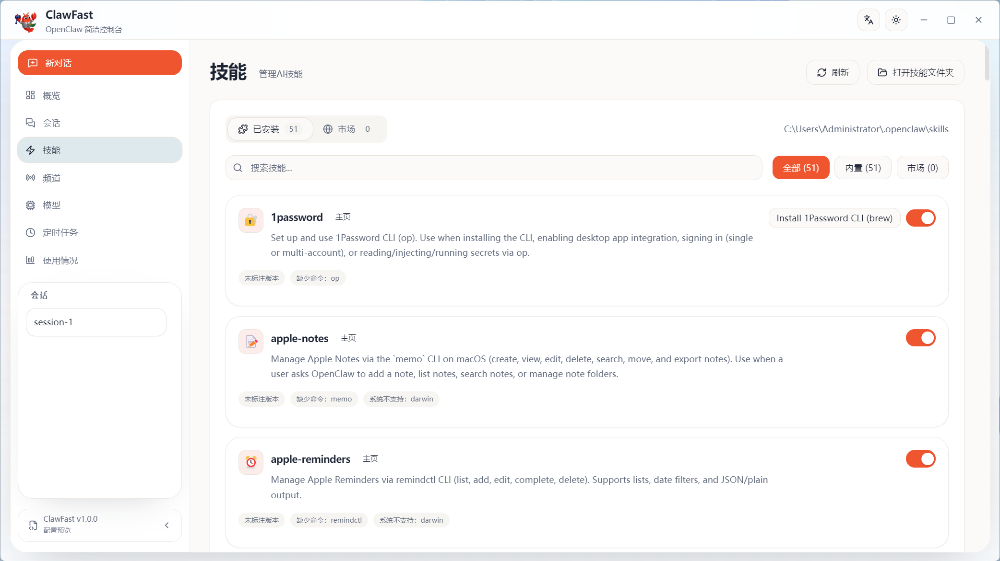
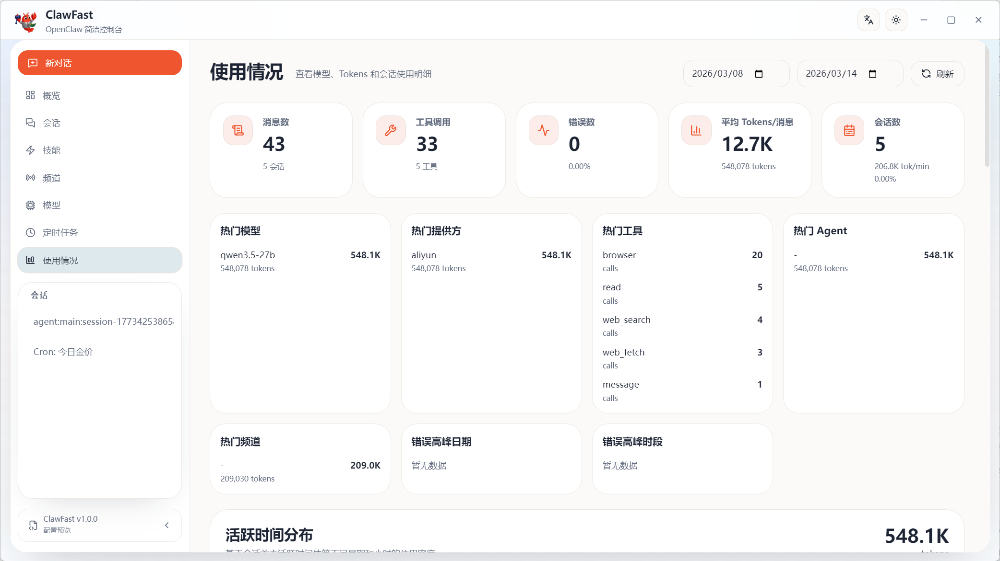

# ClawFast

> A productized desktop admin console for OpenClaw, built for long-term operations.
>
> 面向长期运维的 OpenClaw 桌面管理控制台。

## Overview | 项目简介

ClawFast is a desktop management layer around OpenClaw. It is designed for teams who want a more stable, productized workflow for configuration, operations, and day-to-day administration.

ClawFast 是围绕 OpenClaw 构建的桌面管理层，重点不是替代 OpenClaw 本身，而是提供更稳定、更产品化的配置、运维和日常管理体验。

Current integration target | 当前集成版本:

- `openclaw@2026.3.2`

## Screenshots | 界面截图

### Dashboard



### Chat



### Channels



### Models



### Scheduled Tasks



### Sessions



### Skills



### Usage



## Highlights | 核心能力

- Two packaging modes: bundled OpenClaw and `admin-only`
- Gateway unavailable fallback with warning banner and retry action
- Reworked model configuration based on providers and routing
- Scheduled task management with modal-based regular / advanced creation
- Desktop UI with light and dark theme support
- Chinese and English localization foundation

- 双打包模式：内置 OpenClaw 与 `admin-only`
- Gateway 断连降级：页面可继续访问，顶部告警并支持重试
- 模型配置已重构为“模型供应商 + 模型路由”
- 定时任务基于弹出层创建，支持普通创建与高级创建
- 支持亮色 / 暗色桌面界面
- 具备中英文基础能力

## Packaging Modes | 打包模式

### With OpenClaw

Bundles OpenClaw into the desktop app. ClawFast can start the bundled gateway on demand.

将 OpenClaw 一并打入桌面应用，ClawFast 可按需拉起内置 gateway。

```bash
npm run package:win
```

### Admin Only

Packages ClawFast as a pure management console. It does not automatically start a gateway.

作为纯管理端打包，不自动拉起 gateway，适合连接已有 OpenClaw 环境。

```bash
npm run package:win:admin
```

## Quick Start | 快速开始

### Install dependencies | 安装依赖

```bash
npm install
```

### Start development | 启动开发环境

```bash
npm run dev
```

### Run type check | 执行类型检查

```bash
npm run typecheck
```

## Build And Package | 构建与打包

### Build | 构建

```bash
npm run build
npm run build:admin
```

### Package | 打包

```bash
npm run package:win
npm run package:win:admin

npm run package:mac
npm run package:mac:admin

npm run package:linux
npm run package:linux:admin
```

## Key Areas | 重点模块

### Gateway State | Gateway 状态

Gateway availability is exposed through local IPC instead of OpenClaw RPC.

Gateway 状态由本地 IPC 提供，而不是直接走 OpenClaw RPC。

- renderer: `window.ipc.gateway.getState()`
- main process: `gatewayClient.isConnected()`
- actual signal: WebSocket `OPEN`

### Model Configuration | 模型配置

The model page is organized around:

- model providers | 模型供应商
- model routing | 模型路由

Current provider flow supports viewing configured providers, adding a provider in a modal, filling provider-specific fields, and validating required inputs before save.

当前供应商流程支持查看已配置项、通过弹层新增供应商、填写各供应商所需字段，并在保存前完成必要校验。

### Scheduled Tasks | 定时任务

The scheduled task page is aligned with the current OpenClaw cron job structure.

定时任务页面已按当前 OpenClaw cron job 结构进行重构。

Current behavior includes:

- modal-based task creation instead of inline editing
- regular create and advanced create modes
- linked field behavior for schedule, payload, session target, wake mode, and delivery
- validation for `announce`, `webhook`, and one-shot task behavior

当前已支持：

- 使用弹层创建任务，不再占用主内容区
- 普通创建与高级创建两种模式
- `schedule`、`payload`、`sessionTarget`、`wakeMode`、`delivery` 等字段联动
- `announce`、`webhook` 和一次性任务相关校验

## Project Structure | 目录结构

```text
main/       Electron main process, gateway integration, IPC
renderer/   Desktop UI built with Next.js + React
shared/     Shared types and contracts between main and renderer
scripts/    Build, packaging, OpenClaw bundling, Node runtime bundling
resources/  Icons, screenshots, and packaging resources
```

## Useful Scripts | 常用脚本

```bash
npm run bundle:node-runtime
npm run bundle:openclaw
npm run prune:openclaw
```

## Tech Stack | 技术栈

- Electron
- Nextron
- Next.js
- React
- TypeScript
- Tailwind CSS
- OpenClaw

## Release Checklist | 发布检查

Before publishing a release:

- packaged app connects to the expected gateway target
- bundled OpenClaw mode starts the bundled gateway correctly
- `admin-only` mode does not auto-start OpenClaw
- model provider configuration saves and loads correctly
- scheduled tasks can be created, edited, disabled, and deleted correctly
- packaged icons and Windows taskbar identity are correct

发布前建议至少确认以下内容：

- 打包后的应用连接到预期的 gateway
- 内置 OpenClaw 模式能正确启动 bundled gateway
- `admin-only` 模式不会自动启动 OpenClaw
- 模型供应商配置可正确保存和加载
- 定时任务可正常创建、编辑、禁用和删除
- 打包图标和 Windows 任务栏身份显示正确

## Roadmap | 后续计划

- Continue refining model provider configuration
- Improve model route selection experience
- Keep polishing scheduled task validation and advanced configuration
- Further unify desktop visual language across pages
- Improve packaging, documentation, and release readiness

- 继续完善模型供应商配置体验
- 优化模型路由选择交互
- 持续打磨定时任务高级配置与校验
- 进一步统一桌面端页面视觉语言
- 提升打包、文档和发布完善度

## License | 许可证

This project is licensed under the [MIT License](./LICENSE).

本项目基于 [MIT License](./LICENSE) 开源。
